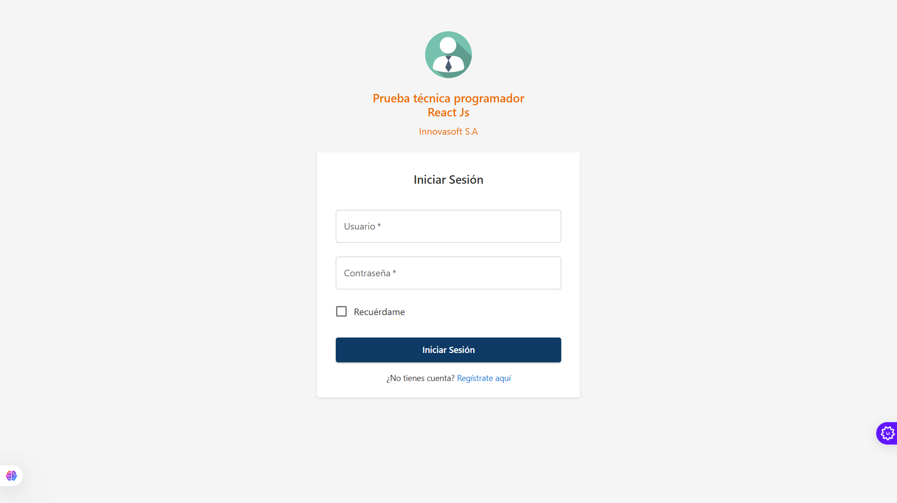

# Prueba Técnica Desarrollador React JS - Innovasoft S.A.

<div align="center">
  

[](https://github.com/PushoDev/prueba-tecnica.innovasof) [](https://reactjs.org/) [](https://mui.com/) [](https://opensource.org/licenses/MIT)

</div>

---

## 📋 Contexto y Objetivo

Este proyecto es una **Single Page Application (SPA)** de alto impacto diseñada para la gestión centralizada de clientes. La solución no solo resuelve el flujo **CRUD** (Crear, Leer, Actualizar, Eliminar), sino que lo eleva mediante una arquitectura robusta, validaciones estrictas y una estética ejecutiva de nivel comercial.

> **Propuesta de solución**: Diseñar un aplicativo que permita dar respuesta técnica y representación gráfica a la gestión de mantenimiento de clientes institucionales.

---

## 🛠 Soluciones Técnicas e Ingeniería

Para cumplir con los estándares de esta prueba, se implementaron soluciones que priorizan la estabilidad frente a integraciones externas complejas:

### 1. Arquitectura de Desacoplamiento (Form Split Strategy)

> **_Importante_ 💻**
> **Justificación Técnica**: Debido a que los modelos de la API para creación (`ClienteCrear`) y actualización (`ClienteActualizar`) presentaban inconsistencias significativas en sus estructuras y tipos requeridos, se tomó la decisión estratégica de **dividir los flujos** en `ClientCreatePage` y `ClientEditPage`.

- Esta separación elimina cualquier colisión de lógica interna.
- Permite un control granular sobre las peticiones HTTP, asegurando que cada payload cumpla exactamente con lo que el backend espera, sin "parches" condicionales en un formulario compartido.

### 2. Conciliación de API y Modelos de Datos (Bridge Pattern)

- **Mapeo de DTOs**: Capa de transformación para reconciliar las diferencias entre los objetos de lectura (`DetalleCliente_DTO`) y los comandos de escritura. Por ejemplo, la API devuelve `telefonoCelular` pero requiere `celular` para el envío; mi implementación resuelve esto de forma transparente al usuario.
- **Normalización de Tipos**: Corrección técnica del campo `sexo` (enviado como Char estricto 'M', 'F', 'O') y procesamiento de imágenes en **Base64** con optimización.

### 3. Interfaz de Usuario Premium

- **Grid v2 Engine**: Uso del sistema moderno de grillas de MUI con la propiedad `size` para un diseño plano, legible y ultra-responsivo.
- **Feedback Proactivo**: Integración de **Snackbars** para estados de éxito/error y **Dialogs** para confirmaciones críticas, eliminando alertas nativas y elevando la percepción de calidad del software.

### 4. Upgrade Estratégico a React 18+

Aunque el requerimiento inicial sugería React 17, se optó por **React 18** por las siguientes ventajas competitivas:

- **Concurrent Rendering**: Preparación para una UI más fluida mediante renderizado concurrente.
- **Automatic Batching**: Optimización automática de re-renders para un mejor rendimiento en formularios complejos.
- **Compatibilidad con MUI v5**: Aprovechamiento total de las APIs de Material UI v5, que están optimizadas para la última versión estable de React.
- **Seguridad y Soporte**: Ciclo de vida más largo y mejores parches de seguridad.

---

## 🚀 Instalación y Ejecución

```bash
# 1. Instalar dependencias
npm install

# 2. Iniciar el entorno de desarrollo
npm start
```

---

## 👤 Autor y Portfolio

Este proyecto fue desarrollado con pasión por:

**Luis Alberto Guisado**

<div align="left">
  <a href="https://pushodev.vercel.app" target="_blank">
    
  </a>
  <a href="https://github.com/PushoDev" target="_blank">
    
  </a>
  <a href="https://www.linkedin.com/in/luis-alberto-pushodev/" target="_blank">
    
  </a>
</div>

---

## 🔌 Stack Tecnológico

- **Core**: React JS (Functional Components + Hooks).
- **Estado Global**: Context API (Auth & Security).
- **Comunicaciones**: Axios (Interceptors para Bearer Tokens).
- **Styling**: Material UI v5 + Estilos personalizados.
- **Ruteo**: React Router Dom v6 (Rutas Privadas/Protegidas).
